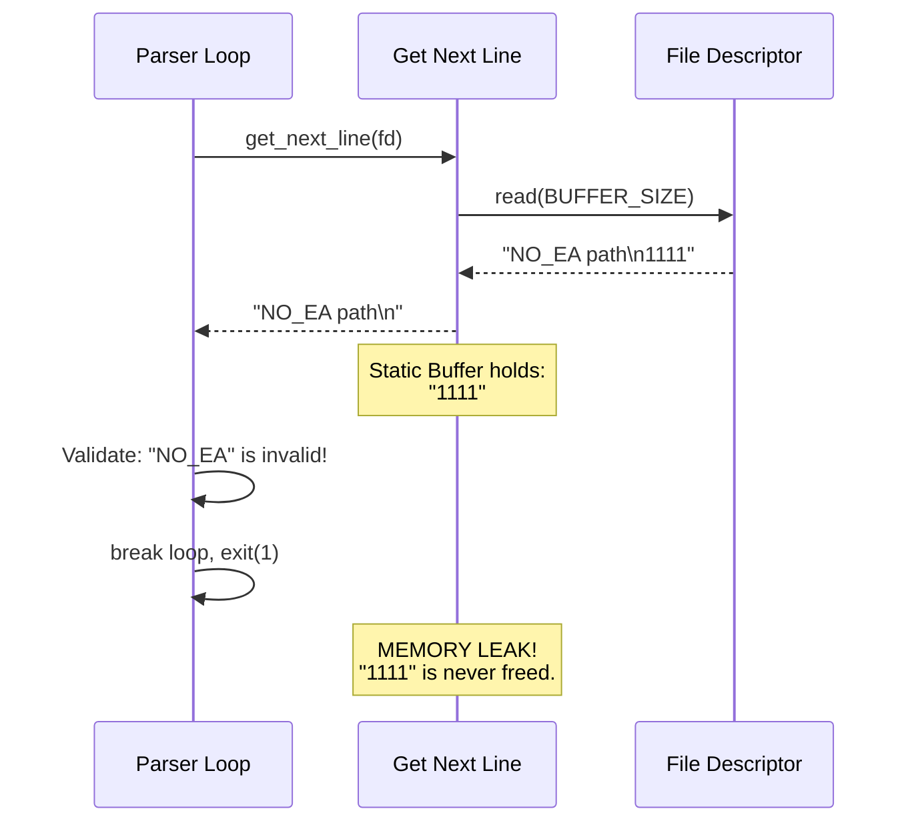

# 01 — Safe File I/O with GNL

Parsing the `.cub` configuration file introduces the very first vector for memory leaks in your program. Your `get_next_line` (GNL) function contains a static buffer. If you do not handle it correctly during an error, you will fail the 42 evaluation instantly.

## The GNL Static Leak
`get_next_line` reads `BUFFER_SIZE` bytes at a time into a static variable. 

Imagine you are reading a file line by line. On line 5, you detect an invalid character in the map and throw an error. You exit your parsing loop.
**Because you didn't read until the EOF (End of File), the static buffer inside GNL still holds allocated memory.** When your program exits, Valgrind will flag this as a "Definitely Lost" leak.



### The Fix
Whenever you encounter a structural error inside your parsing loop, you cannot immediately break. You must loop until GNL returns `NULL`, simply `free()`ing the lines without storing them, effectively flushing the pipe.

```c
void flush_gnl(int fd, char *current_line)
{
    char *dump;

    // Free the line that caused the error
    if (current_line)
        free(current_line);

    // Read the rest of the file into the void to clear the static buffer
    dump = get_next_line(fd);
    while (dump != NULL)
    {
        free(dump);
        dump = get_next_line(fd);
    }
}
```

## Directory vs File Check
Opening a folder using `open()` may return a valid file descriptor on some versions of macOS, but reading from it will behave unpredictably. Protect your parser by opening the file, immediately reading one byte, or checking if the path ends exactly in `.cub`.

```c
int check_extension(char *filename)
{
    int len = ft_strlen(filename);
    if (len < 4)
        return (0);
    if (ft_strncmp(filename + len - 4, ".cub", 4) == 0)
        return (1);
    return (0);
}
```
