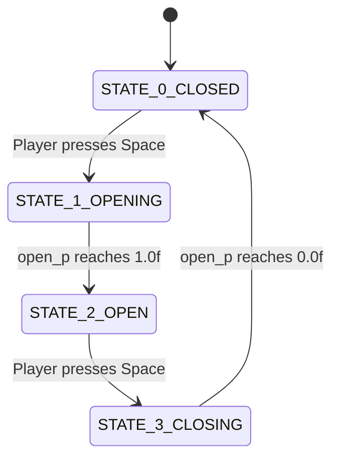

# 03 — Interactive Doors

Doors add a layer of complexity to the 2D grid structure. In memory, an open door allows rays to pass through, but a closed door acts like a wall.

## The Door Structure
Instead of representing doors only as a `char 'D'` inside the map array, we need to track animation states to make them slide open.

```c
typedef struct s_door
{
    int        x;        // Map grid coordinate X
    int        y;        // Map grid coordinate Y
    int        state;    // 0 = Closed, 1 = Opening, 2 = Open, 3 = Closing
    float      open_p;   // 0.0f (fully closed) to 1.0f (fully open)
} t_door;
```

## The Raycasting Modification
When shooting your DDA ray, if you hit a `'D'` tile, you don't immediately register a collision. You need to check the `open_p` value.

**If `open_p` is 0.0 (closed):** 
The ray stops there, exactly like hitting a `'1'`. You draw the door texture.

**If `open_p` is 1.0 (open):** 
The DDA algorithm ignores the `'D'` and continues stepping forward as if it were floor data.

**If `open_p` > 0.0 and < 1.0 (animating):**
You must find the exact `wallX` float hit point. 
If your ray hits the door at `wallX = 0.8`, but the door has slid out of the way to `open_p = 0.5`... the ray missed the physical door material! It passes through.

## Interacting With Doors
We check if the player pressed Spacebar near a door. We don't raycast or aim at it; we just check raw Euclidean distance.



```c
void interact_doors(t_game *game)
{
    for (int i = 0; i < game->door_count; i++)
    {
        t_door *d = &game->doors[i];
        
        // Euclidean distance from player to door tile center
        float dx = (d->x + 0.5f) - game->pos_x;
        float dy = (d->y + 0.5f) - game->pos_y;
        float dist = sqrt(dx*dx + dy*dy);

        // If within 1.5 grid cells
        if (dist < 1.5f)
        {
            if (d->state == 0)      d->state = 1; // start opening
            else if (d->state == 2) d->state = 3; // start closing
        }
    }
}
```

## The Animation Hook
In your main `game_loop` hook, process all door states every frame:
```c
if (d->state == 1) // Opening
{
    d->open_p += 1.0f * delta_time; // Open completely in 1 second
    if (d->open_p >= 1.0f)
    {
        d->open_p = 1.0f;
        d->state = 2; // Locked Open
    }
}
```
