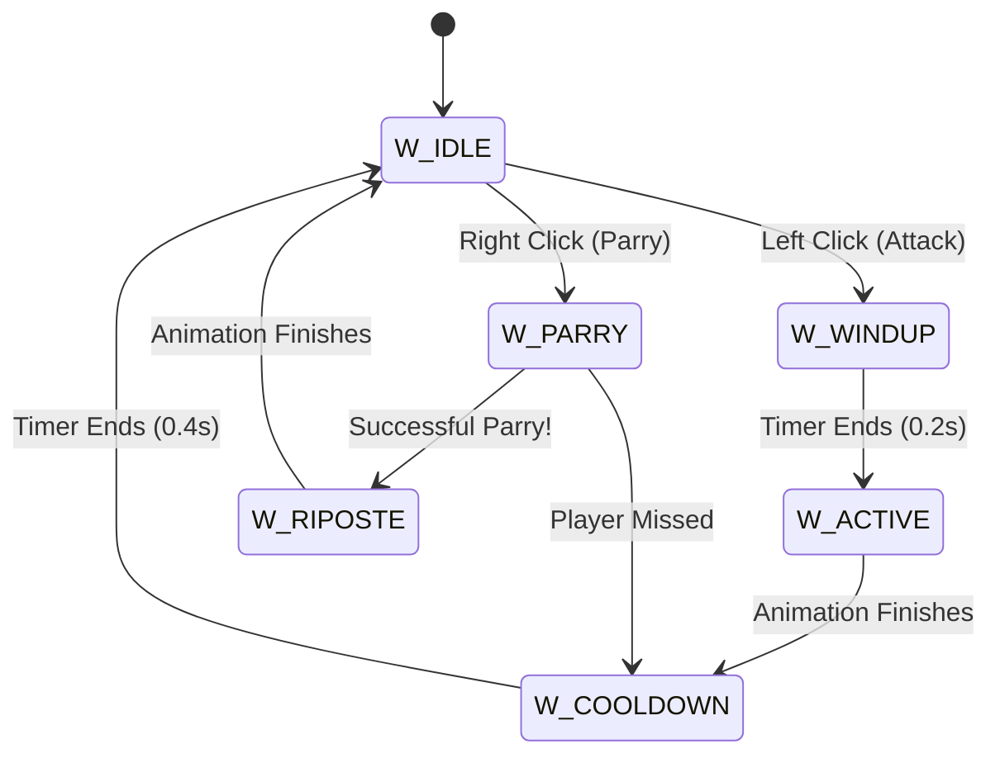

# 03 — Defensive Parry Timing

A block is static, but a parry requires tight execution windows. Implementing a parry requires analyzing the state machine of the *enemy* when the player activates the parry input.

## The Theory
When an enemy is preparing to attack, they enter an `ATTACK_WINDUP` state which delays their active damage frames. When the Player presses the Parry button (Right Mouse Button), the game checks if the incoming enemy is currently trapped inside that windup window.



## The Implementation

**1. Triggering the Parry Input:**
When the player hits the input, they enter a `W_PARRY` state for exactly N frames.

```c
#define PARRY_WINDOW 0.25f // Quarter of a second

if (keycode == MOUSE_RIGHT && weapon.state == W_IDLE)
{
    weapon.state = W_PARRY;
    weapon.timer = PARRY_WINDOW;
}
```

**2. Checking if the Parry succeeded:**
Inside your main engine tick, check if a parry is active. If it is, verify if the enemy is attacking us. We run the exact same `melee-hit-detection` cone logic we used for our own attack!

```c
void check_parry_collisions(t_game *game)
{
    if (game->weapon.state != W_PARRY) return; // Player is not parrying

    for (int i = 0; i < game->entity_count; i++)
    {
        t_entity *e = &game->entities[i];

        // Is the enemy in the parry window?
        if (e->state == ATTACK_WINDUP)
        {
            // Did that enemy target the player closely?
            if (is_entity_in_cone(game, e, MELEE_RANGE, MELEE_CONE_RAD))
            {
                // PERFECT PARRY ACHIEVED.
                e->state = STUNNED;
                e->timer = 2.0f; // Stunned for 2 entire seconds!
                
                trigger_parry_spark_effect(); // UI feedback
                play_sound("parry_clang.wav");
                
                // End player parry animation into a heavy attack follow-up
                game->weapon.state = W_RIPOSTE; 
            }
        }
    }
}
```

## Designing the Hit Punishment
If the player swings blindly and forces `weapon.state` into `W_WINDUP`, they cannot legally enter `W_PARRY`. If the enemy attacks them during their own windup, they take unprotected damage. This forces players to choose between aggression and defense, turning a basic raycaster into a tense skill-based minigame.
