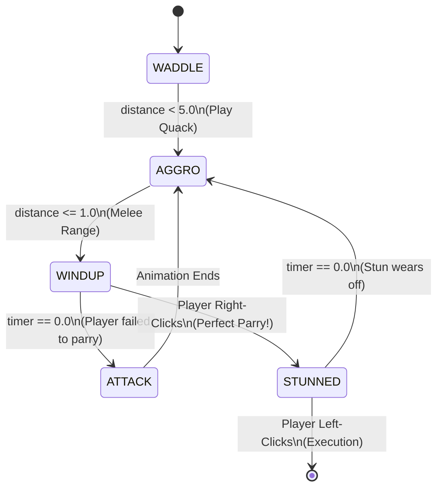

# 04 — The Duck AI States

If we are implementing a Sekiro/Chivalry-style combat loop with our Duck asset, we cannot use generic pathfinding and standard melee. We need specialized timing windows to make the Parry mechanic viable.

## The Duck's Biological FSM
We will give our Duck 5 specific biological states.

```c
typedef enum e_duck_state {
    DUCK_WADDLE = 0,    // Idle patrolling
    DUCK_AGGRO,         // Sees player, plays loud "Quack!" sound
    DUCK_WINDUP,        // Telegraphed bite animation (PARRY WINDOW)
    DUCK_ATTACK,        // The active bite (Deals damage)
    DUCK_STUNNED        // Result of a player parry
} t_dstate;
```




## Creating the Window of Opportunity
The most critical part of this Combat Lab is the `DUCK_WINDUP`. 

Without a windup, the duck will transition from `WADDLE` directly into `ATTACK`. The player cannot predict instant code execution. We must give the duck a windup animation that lasts exactly *0.6 seconds*.

```c
void update_duck_ai(t_game *game, t_entity *duck, double dt)
{
    // ... distance math from 08-sprites/02-entity-state-machine ...

    if (duck->state == DUCK_AGGRO)
    {
        // Move towards player mathematically
        move_entity_towards(duck, game->pos_x, game->pos_y, dt);

        if (dist <= 1.0) // Player is in melee range!
        {
            duck->state = DUCK_WINDUP;
            duck->timer = 0.6; // Force the duck to hesitate for 0.6 seconds
            
            // Switch sprite to the telegraphed "Open Beak" animation
            duck->current_tex = game->tex_duck_windup; 
        }
    }
    else if (duck->state == DUCK_WINDUP)
    {
        duck->timer -= dt; // Tick down real time
        
        if (duck->timer <= 0)
        {
            // The hesitation is over. If player is still close, BITE!
            duck->state = DUCK_ATTACK;
            duck->timer = 0.2; // The active bite lasts 0.2 seconds
            
            if (dist <= 1.5) // Player didn't run away!
                player_take_damage(game, 20);
        }
    }
}
```

## Integration with Player Parry
As we built in `03-parry-timing.md`, when the player right-clicks, we check the Duck's state.

If the Player right clicks and the Duck's state is `DUCK_WINDUP`, we instantly force the Duck into `DUCK_STUNNED`.
```c
if (duck->state == DUCK_WINDUP)
{
    // PERFECT PARRY SUCCESS!
    duck->state = DUCK_STUNNED;
    duck->timer = 1.5; // Duck freezes for 1.5 seconds
}
```

This creates a high-tension game loop:
1. Duck aggros and rushes you.
2. Duck stops moving and opens its beak (`DUCK_WINDUP`).
3. You must hit Parry within `0.6 seconds`. If you wait until `0.61 seconds`, the duck transitions to `DUCK_ATTACK` and you take damage.
