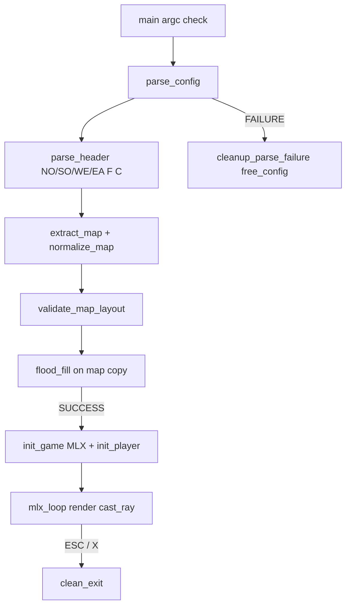

# Our Methodology & Oral Defense Brief

*Team: thanh-ng (parser / validation / teardown) · lwittwer (MLX / DDA / movement)*

Use this sheet to rehearse the evaluation. Speak in your own words; do not memorize
as a script. Every claim below should match the code you can open and point at.

---

## 1. How we split the work

| Area | Owner | Where to look |
|------|-------|----------------|
| `.cub` I/O, header, colors, map pad, flood fill | thanh-ng | `src/parser/` |
| Shared config struct `t_game` | both (contract) | `includes/structs.h` |
| MLX window, image buffer, render loop | lwittwer | `src/game/init_game.c`, `graphics.c` |
| Player spawn / dir / plane | lwittwer | `src/game/init_utils.c` |
| DDA raycast + flat walls | lwittwer | `src/game/ray.c` |
| WASD / rotate / ESC | lwittwer | `src/game/handle_input.c`, `rotate.c`, `close.c` |
| Full teardown `clean_exit` | thanh-ng (+ wired by both) | `src/parser/free_map.c`, `free_cub_struct` |

**Contract:** Parser fills `t_game` (paths, `floor`/`ceiling` RGB, padded `map`).
Game never re-parses the file; it reads `c->config` and derives the player from
`N/S/E/W` still on the grid.

---

## 2. End-to-end methodology (what happens when you run `./cub3d map.cub`)

### Parser pipeline (say this in ~90 seconds)

1. **File** — must end in `.cub`, openable, not a directory (`validate_file`).
2. **Load** — `get_next_line` into a line array (`load_lines`).
3. **Header** — accept `NO/SO/WE/EA/F/C` in any order until a non-header line;
   reject duplicates / missing IDs (`parse_header` + `set_texture` / `set_color`).
4. **Map** — everything after header is the map; pad rows to max width with spaces
   (`normalize_map`); seal empty outer corners if needed.
5. **Validate** — only `0 1 N S E W` and space; exactly one spawn; **flood fill**
   from the player on a **copy** of the map: hitting space or leaving bounds means
   not closed.
6. **Fail path** — `cleanup_parse_failure` frees lines + `free_config` (textures + map).

### Color methodology (common eval question)

- Split on `,` into exactly 3 parts.
- Each part must be **digits only** (`ft_isdigit`) — so `+1` and `-1` are **rejected**.
- Value must be in `0..255`.
- Store as `int floor[3]` / `ceiling[3]` (not one packed int).
- Game packs later: `(R << 16) | (G << 8) | B` for MiniLibX (`rgbToInt` in `graphics.c`).

### Game / render methodology (say this in ~90 seconds)

1. **Init** — `mlx_init` → window → image → `addr`; `init_player` finds spawn,
   sets cell to `'0'`, sets `dir_*` and `plane_*` from N/S/E/W.
2. **Each frame** — draw floor/ceiling halves; for each screen column `x`, `cast_ray`:
   - `camera_x = 2*x/W - 1`
   - `ray_dir = dir + plane * camera_x`
   - DDA until `map[map_y][map_x] == '1'`
   - `perp_wall_dist` (fisheye fix) → line height → vertical stripe color
3. **Input** — WASD move/strafe; rotate updates both `dir` and `plane` together.
4. **Exit** — `clean_exit`: destroy MLX resources, then `free_config`, then `exit`.

---

## 3. Design choices we can defend

| Choice | Why |
|--------|-----|
| Flood fill on a **copy** | Live map keeps spawn letter for `init_player`; validation does not mutate playable grid permanently. |
| Spaces = void | Subject allows spaces; walkable flood treats space as “leak” (not closed). |
| No rectangular border-only check | L-shaped maps are valid if enclosed; flood fill is the real rule. |
| Reject `+` / `-` in RGB | Only plain digits; avoids ambiguous `+42` / signed junk. |
| Image buffer + one `mlx_put_image_to_window` | Avoid per-pixel `mlx_pixel_put` (too slow). |
| `perp_wall_dist` not Euclidean | Stops fisheye on flat walls. |
| `clean_exit` single door for ESC/X | One teardown order; easier to valgrind and explain. |

---

## 4. Known gaps (be honest if asked)

Say what is done and what is in progress — evaluators prefer honesty + a plan.

| Topic | Status |
|-------|--------|
| Parser + invalid/valid maps + parser valgrind | Done |
| Flat-color 3D + F/C + WASD | Done |
| Wall textures (load/sample XPM) | Not done — paths parsed; XPMs in `textures/` |
| ←/→ must rotate (subject) | Not done — Q/E rotate today; arrows strafe |
| `camera_y` vs `camera_x` in `ray_dir_y` | Bug marked in `ray.c` — must fix |
| Game-side norm / debug `printf` | Open |
| 2D debug minimap module | Skipped; helpers exist commented — possible future minimap |

---

## 5. Oral defense Q&A — our answers

### Parser (thanh-ng leads; lwittwer must still understand)

**Q: How do you handle uneven row lengths?**  
We measure max width, then pad every row with spaces to that width so `map[y][x]`
is always in-bounds for `0 <= x < width`.

**Q: How do you prove the map is closed?**  
Copy the map, find the unique spawn, flood fill through `0` and spawn cells.
If we step on space or out of bounds → not closed → `Error`. Walls (`1`) stop the fill.

**Q: Two spawns or zero?**  
`validate_player_count` requires count == 1. Otherwise `Error` and cleanup.

**Q: Walk me through floor color `F 220,100,0`.**  
Skip spaces after `F`, `ft_split` on `,`, require 3 digit-only tokens in 0–255,
store in `floor[0..2]`. Game later packs to one int for drawing.

**Q: Invalid file — what is freed?**  
`parse_config` failure goes through `cleanup_parse_failure`: free line array and
`free_config` (four path strings + map). Nothing left allocated from the parse.

### Renderer (lwittwer leads; thanh-ng must still understand)

**Q: What is the camera plane?**  
A 2D vector perpendicular to `dir`. Its length sets FOV. For column `x`,
`ray_dir = dir + plane * camera_x` with `camera_x` from -1 to +1 across the width.

**Q: What are deltaDist / sideDist?**  
`deltaDist*` = how far along the ray to cross one full grid line in X or Y
(`fabs(1/ray_dir_*)`). `sideDist*` = distance to the *next* grid line from the
player. DDA always steps the smaller sideDist (X or Y).

**Q: Vertical vs horizontal hit?**  
If we stepped in X last → `side = 0` (vertical grid line). If Y → `side = 1`.
That drives shading / later texture choice (N/S vs E/W with `step_*` signs).

**Q: Fisheye?**  
Euclidean distance to the hit is longer at FOV edges → curved walls.
We use perpendicular distance to the camera plane (`perp_wall_dist`) so a flat
wall stays flat.

**Q: Why not `mlx_pixel_put`?**  
Too many syscalls per frame. We write into an image buffer (`put_pixel` on `addr`)
and blit once with `mlx_put_image_to_window`.

### Memory / exit (both)

**Q: ESC or window X?**  
`on_close` → `clean_exit`: `free_cub_struct` (image, window, display, player, ray)
then `free_config` (paths + map) then `exit`.

**Q: How do you check leaks?**  
`make valgrind-parser` (all maps, parse-only).  
`make valgrind-mlx` (MLX init + `clean_exit`, no loop).  
Manual play + ESC after textures exist. Ignore typical X11 “still reachable”.

---

## 6. Two-minute drills (run these out loud)

### Drill A — Parser only (timer 2:00)

Open `parse_entrypoint.c` and narrate:
`validate_file` → `load_lines` → `parse_header` → `extract_map` →
`normalize_map` → `validate_map_layout` / flood fill → success or cleanup.

### Drill B — DDA only (timer 2:00)

Open `ray.c` and narrate one column:
`init_ray` → `calculate_step` → `perform_dda` → `calculate_perp_wall_dist` →
`calculate_line_height` → `draw_vertical_line`.

### Drill C — Cleanup (timer 1:00)

Open `free_map.c` + `free_struct.c` + `close.c`. List free order without notes.

### Drill D — Swap roles

Parser owner explains DDA; game owner explains flood fill. If either freezes,
that topic is next study target.

---

## 7. File map for “show me in the code”

| Topic | File |
|-------|------|
| Orchestration | `src/parser/parse_entrypoint.c` |
| Colors | `src/parser/parse_colors.c` |
| Flood fill | `src/parser/flood_fill.c` |
| Teardown | `src/parser/free_map.c`, `src/game/free_struct.c` |
| Player init | `src/game/init_utils.c` |
| DDA | `src/game/ray.c` |
| Frame | `src/game/graphics.c` |
| Keys | `src/game/handle_input.c` |
| Structs | `includes/structs.h` |

---

## 8. Related docs

- Question bank: [`evaluation-questions.md`](./evaluation-questions.md)
- Math Q&A: [`../modules/11-evaluation/02-defense-qna.md`](../modules/11-evaluation/02-defense-qna.md)
- Valgrind commands: [`../modules/12-debugging/02-valgrind-cheat-sheet.md`](../modules/12-debugging/02-valgrind-cheat-sheet.md)
- Eval checklist: [`../FINAL_CHECKLIST.md`](../FINAL_CHECKLIST.md)
