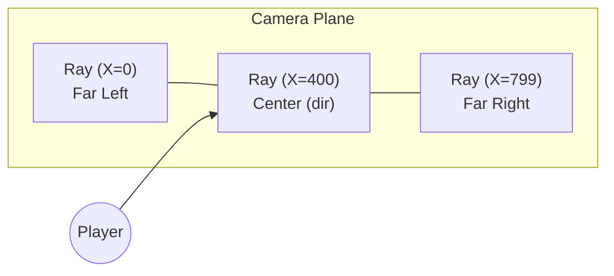

# Theory: Vector Math & The Camera Plane

Unlike true 3D environments (like Unity) which use projection matrices against Z-vertices to map triangles onto a 2D viewport, a Raycaster is fundamentally a 2D engine. We trick the human eye by sending out beams along a 2D grid and scaling a stick up and down based on the returned distance.

To send 800 parallel beams mathematically without crashing the CPU, we do not use angles (degrees or radians). We use **Vectors**.

## 0. Why NOT Angles? (The Naive Approach)

Before learning the correct solution, it is important to understand the approach that seems obvious and why it fails. This is the classic mistake a new programmer makes when they first imagine a raycaster.

### The Angle-Based Approach (❌ Bad, CPU Killer)

The intuitive model: the player has a `facing_angle` in degrees. To cast 800 rays, you spread them from `facing_angle - 30°` to `facing_angle + 30°` (a 60° FOV). For each of the 800 rays, you convert the angle to a direction and step along it.

```c
/* NAIVE ANGLE APPROACH — Do NOT use this */
void    cast_all_rays_naive(t_game *game)
{
    int     ray;
    double  angle;
    double  step;
    double  ray_x;
    double  ray_y;

    step = (FOV_DEGREES / SCREEN_W) * (M_PI / 180.0); // convert per-ray step to radians
    angle = game->player_angle - (FOV_DEGREES / 2.0) * (M_PI / 180.0); // start angle
    ray = 0;
    while (ray < SCREEN_W)    // 800 iterations
    {
        ray_x = cos(angle);   // 🚨 cos() call #1  — TAYLOR SERIES COMPUTED HERE
        ray_y = sin(angle);   // 🚨 sin() call #2  — TAYLOR SERIES COMPUTED HERE
        cast_single_ray(game, ray_x, ray_y, ray);
        angle += step;
        ray++;
    }
}
```

**Why this destroys performance:**

Every call to `cos()` and `sin()` internally runs the [Taylor Series](https://en.wikipedia.org/wiki/Taylor_series) expansion — a loop of floating-point multiply-accumulate operations:

```
sin(x) ≈ x - (x³/3!) + (x⁵/5!) - (x⁷/7!) + ...
```

Each `sin()` or `cos()` call requires roughly **~20–80 floating-point multiplications and additions** depending on the CPU and precision required.

**The cost per frame:**
| Step | Operations |
|------|-----------|
| Rays cast per frame | 800 |
| `sin()` + `cos()` calls per ray | 2 |
| Total trig function calls per frame | **1,600** |
| Taylor Series FP operations per call | ~40 |
| **Total FP operations per frame** | **~64,000** |
| At 60 FPS | **~3,840,000 floating-point ops/sec just for angles** |

On top of this, if you add 50 rotating duck enemies, each needing their own angle computation every frame: another `100 * 40 = 4,000` operations. Mouse-look adds more rotations still. It compounds rapidly.

### The Fisheye Problem (Bonus Trap)

The angle approach also introduces a second, fatal visual bug: **Fisheye Distortion**.

When you spread your rays evenly from `-30°` to `+30°` around the player, the rays at the edges of the screen travel at a steeper angle than the center ray. A wall that is flat and horizontal in front of you appears curved — like you are looking through a fish tank.

```
Angle-based rays:          Vector-based rays:
        |                         |
   \    |    /              | | | | | | |
    \   |   /               | | | | | | |
     \  |  /                 | | | | | |
player  .                  player  .
```

Correcting fisheye with angles requires dividing distances by `cos(angle_offset)` — yet another trig call per column.

### The Vector Solution (✅ Correct)

Vectors **pre-encode** the direction algebraically. The Camera Plane spreads the 800 rays by pure multiplication — zero `cos()`/`sin()` calls during the main raycast loop:

```c
/* VECTOR APPROACH — used in DDA */
void    cast_all_rays(t_game *game)
{
    int     x;
    double  camera_x;   // position on camera plane: -1.0 (left) to +1.0 (right)
    double  ray_dir_x;
    double  ray_dir_y;

    x = 0;
    while (x < SCREEN_W)
    {
        // Scale the camera plane — pure arithmetic, ZERO trig functions
        camera_x = 2.0 * x / (double)SCREEN_W - 1.0;
        ray_dir_x = game->dir_x + game->plane_x * camera_x;
        ray_dir_y = game->dir_y + game->plane_y * camera_x;

        cast_single_ray(game, ray_dir_x, ray_dir_y, x);
        x++;
    }
}
```

**Operations:** Only 4 multiplications and 2 additions per ray. No Taylor Series. No fisheye distortion because the Camera Plane is already perpendicular geometry.

**Cost comparison:**
| Method | FP ops per frame (800 rays) |
|--------|---------------------------|
| Angle-based (`cos`/`sin` per ray) | ~64,000 |
| Vector-based (multiply + add) | ~4,800 |
| **Speedup** | **~13× faster** |

Trig functions are only called **twice per frame** in the vector approach — once when the player presses Left/Right to rotate (applying the 2D Rotation Matrix to update `dirX/Y` and `planeX/Y`). That cost is negligible at 2 calls vs 1,600.

## 1. What is a Vector?
A vector in our engine represents a **Direction**.
If `dirX = -1` and `dirY = 0`, you are looking directly to the West. 
If `dirX = 0` and `dirY = 1`, you are looking directly to the South.

If you walk forward, we add the direction vector to our player position:
```c
playerX += dirX * moveSpeed;
playerY += dirY * moveSpeed;
```

## 2. What is the Camera Plane?
If you only have a direction vector, you can only shoot ONE ray directly forward. You would only see a 1-pixel wide line.
To see 800 pixels side-by-side, we must "spread" the rays out left and right of our nose.

This spread is called the **Camera Plane** (`planeX`, `planeY`).
For a standard 66-degree Field of View (FOV):
- If looking West (`dirX = -1`, `dirY = 0`)
- The Camera Plane must be perpendicular. `planeX = 0`, `planeY = 0.66`

## 3. Multiplying The Camera Plane
To calculate the angle of Ray #400 (which is the center of an 800px screen):
1. Find its offset. `400 / 800 = 0.5`. 
2. Scale it into a [-1 to +1] range. `2.0 * 0.5 - 1.0 = 0`.
3. Multiply the Camera Plane by `0`. The result is the raw Direction vector.

To calculate Ray #800 (the extreme right edge of the screen):
1. Find its offset. `800 / 800 = 1.0`.
2. Scale it. `2.0 * 1.0 - 1.0 = +1.0`.
3. The Ray is `Direction + (CameraPlane * 1.0)` -> `(-1 + 0) + (0 + 0.66)` -> `(-1, 0.66)`.

## 4. The Standard 2D Rotation Matrix
When the player presses the `Left` or `Right` arrow key to look around, we cannot simply add numbers to `dirX`. If you hit `dirX = 2.0` or `3.0`, the math instantly collapses. Vectors must stay normalized.

To reliably turn left and right, we must multiply BOTH `dirX/dirY` and `planeX/planeY` by an identical geometric rotation matrix.
```
x' = x * cos(rotation_speed) - y * sin(rotation_speed)
y' = x * sin(rotation_speed) + y * cos(rotation_speed)
```

**CAUTION IN C CODE:** 
You must store the "old X direction" in a temporary variable before mutating it!
```c
// THIS IS WRONG:
dirX = dirX * cos(rot) - dirY * sin(rot);
// By the time you get here, dirX is already a mutated value!
dirY = dirX * sin(rot) + dirY * cos(rot); 
```

**CORRECT EXECUTION:**
```c
double old_dirX = dirX;
dirX = dirX * cos(rot) - dirY * sin(rot);
dirY = old_dirX * sin(rot) + dirY * cos(rot);
```

## 5. The Camera Plane Visualized

It helps to think of the Camera Plane as a physical bar floating in front of the player:



The player's `dir` vector always points to the exact center of the Camera Plane. The `plane` vector defines how wide the bar extends left and right. Increasing the length of `plane` widens the FOV. Crucially, `plane` must always stay at 90° relative to `dir` — **if you rotate `dir`, you must rotate `plane` by the exact same angle**, or the world image will shear and warp.

## 6. Vector Normalization

A vector is **normalized** when its magnitude (length) equals exactly `1.0`. The 2D Rotation Matrix only works correctly on normalized unit vectors. If vector length drifts from exactly `1.0` due to floating-point rounding over many thousands of rotations, your FOV will very slowly shrink or expand.

The magnitude of a 2D vector is:
```c
double magnitude = sqrt(dirX * dirX + dirY * dirY);
```

To normalize:
```c
dirX = dirX / magnitude;
dirY = dirY / magnitude;
```

In practice, the 2D rotation matrix does not change the vector's length — it only rotates it. So drift is minimal in practice. However, if you implement a Trig Lookup Table or manually overwrite `dir`, always renormalize after mutation to be safe.

## 7. The FOV Formula

The exact Field of View angle your engine renders is determined by the ratio of the Camera Plane's length to the Direction Vector's length.

```
FOV = 2 * atan(plane_length / dir_length) degrees
```

For a standard `dir` of length `1.0`:
- `plane_length = 0.66` → FOV = `2 * atan(0.66)` ≈ **66 degrees**
- `plane_length = 1.0`  → FOV = `2 * atan(1.0)` = **90 degrees**

Most first-person shooters use 60–90 degrees. Values beyond 100 degrees create extreme distortion at the screen edges and look similar to a fisheye camera lens.
